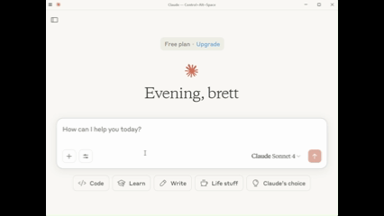

# Vessel Information Search
Agentic LLM to get more information about vessels. 




## MARINE CADASTRE

From their website, "With more than 150 data layers in its catalog, Marine Cadastre is the premier source for authoritative and trusted ocean geospatial data. The initiative was established in 2007 by NOAA and BOEM in response to the growing need for spatial data and tools to support offshore infrastructure. Fast forward to today, Marine Cadastre continues to work closely with national, regional, and industry partners to develop and provide direct access to the best-available data and tools to meet the needs of the ocean planning community."

## Data dictionary

| Field Name          | Description                                                           |
| ------------------- | --------------------------------------------------------------------- |
| MMSI                | Maritime Mobile Service Identity; a unique identifier for each vessel |
| BaseDateTime        | Timestamp of the AIS message (UTC)                                    |
| LAT                 | Latitude of the vessel at the time of the message                     |
| LON                 | Longitude of the vessel at the time of the message                    |
| SOG                 | Speed Over Ground in knots                                            |
| COG                 | Course Over Ground in degrees                                         |
| Heading             | Vessel heading in degrees                                             |
| VesselName          | Name of the vessel (if available)                                     |
| IMO                 | International Maritime Organization number (if available)             |
| CallSign            | Vessel radio callsign (if available)                                  |
| VesselType          | Numeric code representing the type of vessel                          |
| Status              | Navigational status (e.g., under way, at anchor)                      |
| Length              | Vessel length in meters                                               |
| Width               | Vessel beam (width) in meters                                         |
| Draft               | Vessel draft in meters                                                |
| Cargo               | Numeric code indicating cargo type                                    |
| TransceiverClass    | Class A or Class B AIS transceiver indicator                          |
| AISVersion          | Version of the AIS protocol used                                      |
| RegionalMsgID       | Regional/local AIS message type (optional)                            |
| TypeOfElectronicFix | GPS fix type (e.g., GPS, DGPS)                                        |


## How to run application

### Virtual environment

Setup the environment using 

```
python -m venv venv
```

Then use,

```
.\venv\Scripts\activate
```

to activate it. 

### Run the application 

I used Gradio on this one to enable MCP support out of the box. 

```
python data-exploration.py
```